# Mermaid Diagram Rules for Agent Script Recipes

This document defines the rules and patterns for creating mermaid diagrams in README files for Agent Script recipes. These rules ensure consistency across all recipe documentation.

## Core Structure Rules

### 1. Graph Type

- **ALWAYS** use `graph TD` (Top-Down orientation)
- Never use other orientations (LR, RL, BT)

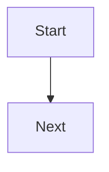

### 2. Node Naming Convention

- Use **sequential capital letters** (A, B, C, D, ...) for node IDs
- Start with `A` for the initial/start node
- Increment sequentially through the flow
- Use descriptive labels within square brackets

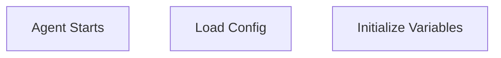

### 3. Flow Direction

- Primary flow goes top-to-bottom
- Use `-->` for standard transitions
- Label decision branches with `|Label|` syntax

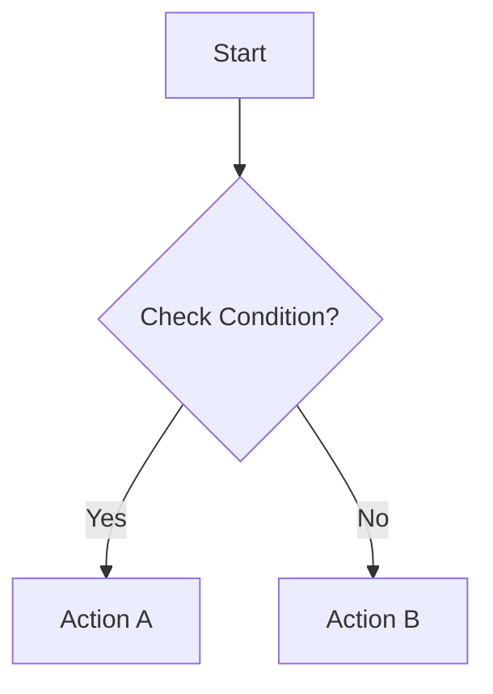

## Node Types and Shapes

### 1. Standard Process Nodes

Use square brackets `[]` for regular process/action steps:

```mermaid
A[Process Data]
B[Call Action]
C[Update Variables]
```

### 2. Decision Nodes

Use curly braces `{}` for conditional/decision points:

```mermaid
B{Check: user_id exists?}
C{Validation Passed?}
D{Amount > Limit?}
```

**Decision Node Patterns:**

- Always phrase as a question ending with `?`
- Use format: `{Check: condition?}` or `{condition?}`
- Common decision types:
    - Existence checks: `{user_id exists?}`
    - Comparison checks: `{Amount > Limit?}`
    - Status checks: `{Success?}`, `{Valid?}`
    - Boolean checks: `{Confirmed?}`

### 3. Multi-line Node Labels

Use `<br/>` for line breaks within node labels:

```mermaid
A[Initialize Variables:<br/>turn_count, session_id,<br/>user_profile]
B[Call process_payment Action]
```

## Styling Recommendations

### Use Theme-Neutral Approach

Use mermaid's built-in theme support for best compatibility across light and dark backgrounds:

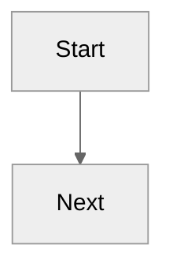

**Recommended themes:**

- `neutral` - Balanced for both light and dark backgrounds
- `base` - Minimal styling, adapts to background automatically
- `default` - Works for most cases

**Note**: Avoid custom color styling unless absolutely necessary, as it may not work well in both light and dark modes.

## Standard Flow Patterns

### 1. Validation Pattern

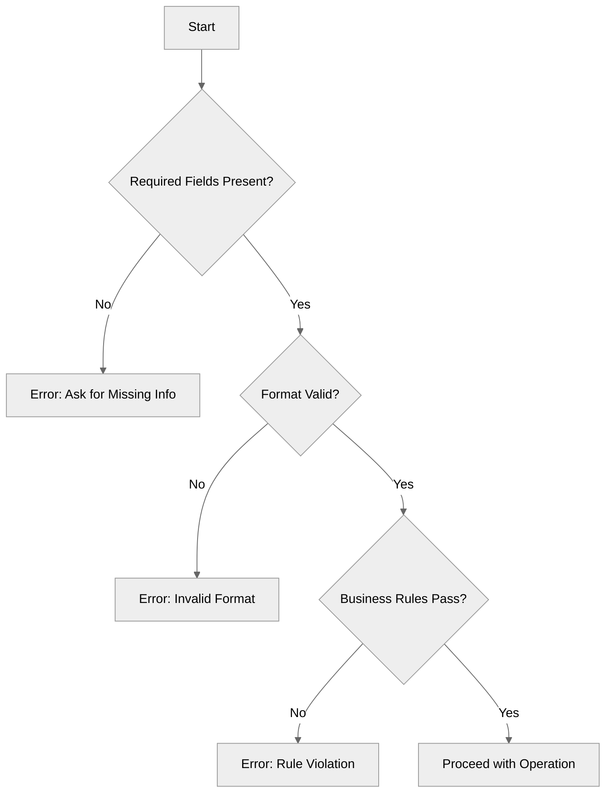

### 2. Action Call Pattern

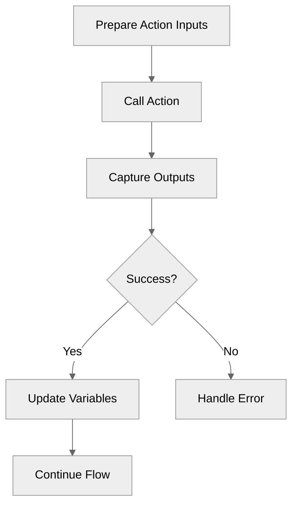

### 3. Topic Transition Pattern

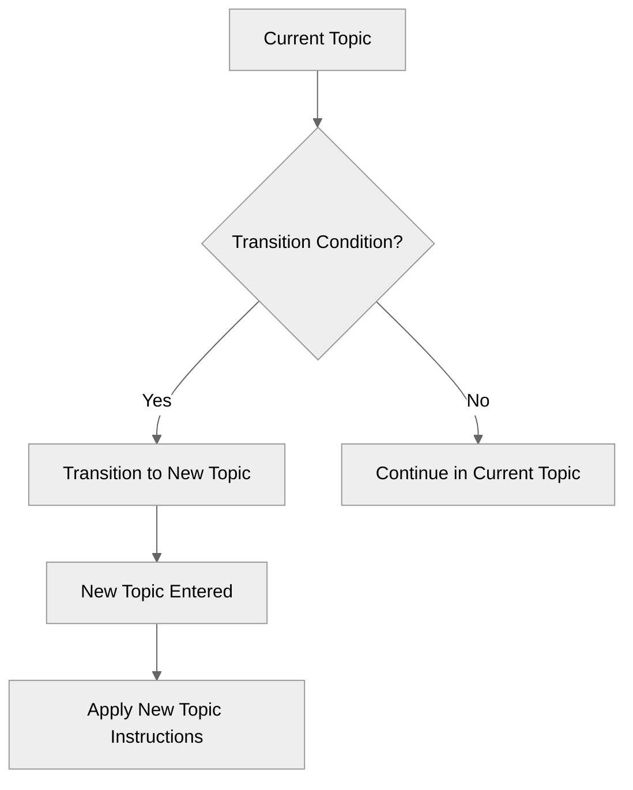

### 4. Lifecycle Hook Pattern

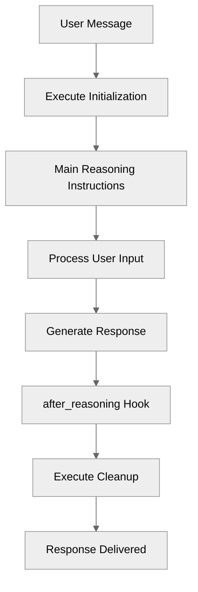

### 5. Multi-Step Workflow Pattern

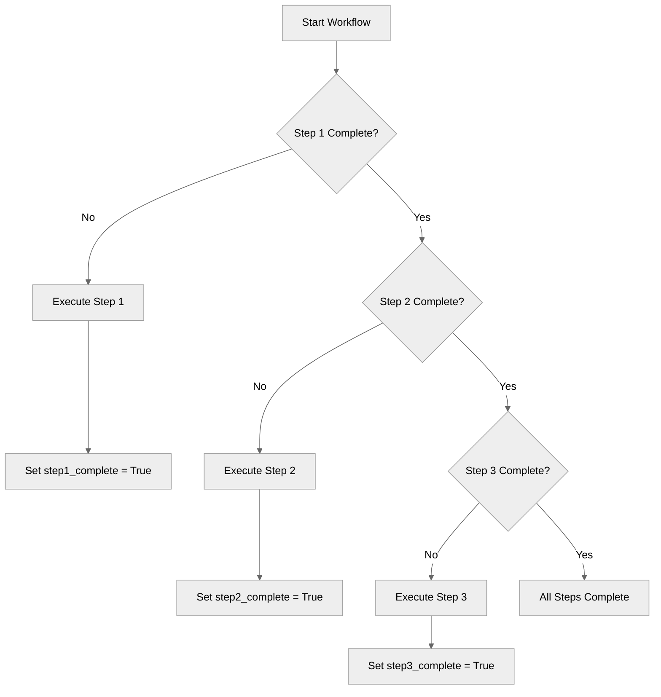

### 6. Error Handling with Retry Pattern

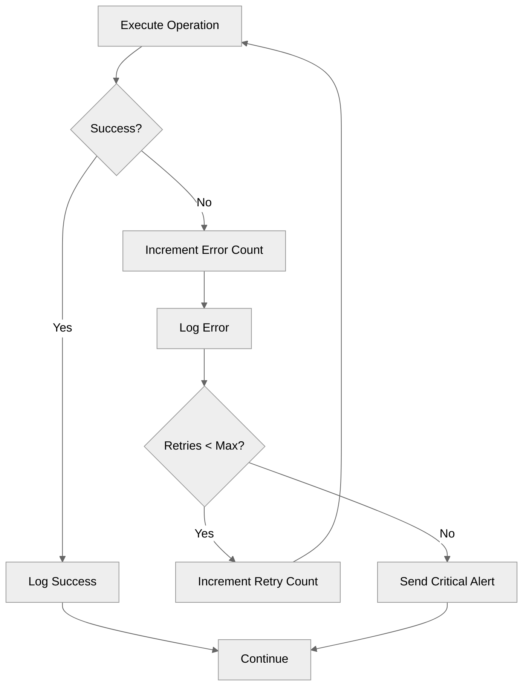

## Common Node Label Conventions

### Action Nodes

- Format: `[Call action_name]`, `[Run action_name]`, `[Execute action_name]`
- Include key parameters if relevant: `[Call process_payment<br/>with amount=$500]`

### Variable Updates

- Format: `[Set variable_name = value]`, `[Update variable_name]`
- Example: `[Set order_status = "shipped"]`

### Topic Transitions

- Format: `[Transition to topic_name]`, `[Enter topic_name Topic]`
- Example: `[Transition to hotel_booking]`

### Lifecycle Events

- Format: `[after_reasoning Hook]`
- Example: `[after_reasoning: Save state]`

### Data Loading

- Format: `[Fetch data_type]`, `[Load data_type from source]`
- Example: `[Fetch user_profile<br/>from database]`

### Instructions/Reasoning

- Format: `[Build Dynamic Instructions]`, `[Process with Instructions]`
- Example: `[Apply Reasoning Instructions]`

## Decision Branch Labels

### Standard Labels

- `|Yes|` / `|No|` for boolean conditions
- `|True|` / `|False|` for boolean values
- `|Valid|` / `|Invalid|` for validation checks
- `|Success|` / `|Failure|` for operation results
- `|Found|` / `|Not Found|` for existence checks

### Specific Value Labels

- `|> 0.7|`, `|0.3-0.7|`, `|< 0.3|` for threshold checks
- `|"pending"|`, `|"shipped"|`, `|"delivered"|` for status values
- `|Continue|`, `|Exit|` for loop controls

## Loop Patterns

### Simple Loop

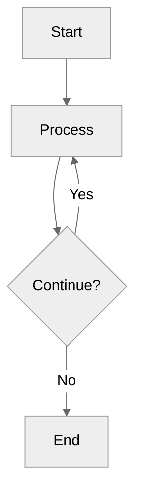

### Loop with Counter

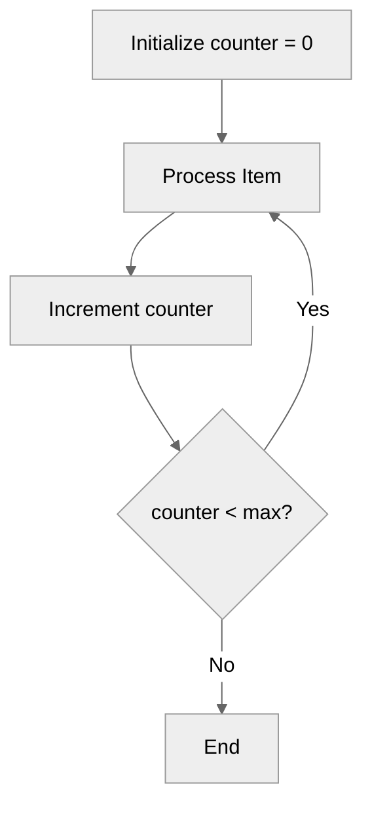

## Best Practices

### 1. Diagram Complexity

- Keep diagrams focused on the main flow
- Maximum 20-25 nodes per diagram
- Split complex flows into multiple diagrams if needed
- Use sub-processes for detail when necessary

### 2. Node Descriptions

- Be concise but descriptive
- Use active voice: "Call Action" not "Action is called"
- Include relevant details: variable names, values, conditions
- Use consistent terminology across all diagrams

### 3. Flow Clarity

- Avoid crossing arrows when possible
- Group related operations visually
- Use vertical alignment for parallel operations
- Keep decision branches clear and readable

### 4. Styling

- Always use `%%{init: {'theme':'neutral'}}%%` at the start of diagrams
- Avoid custom color styling for better light/dark mode compatibility
- Let the theme handle visual distinction automatically

### 5. Annotations

- Use `<br/>` sparingly - only when necessary for clarity
- Keep node labels to 1-3 lines maximum
- Use consistent formatting for similar nodes
- Include key variable updates in node labels

## Complete Example

Here's a complete example following all rules:

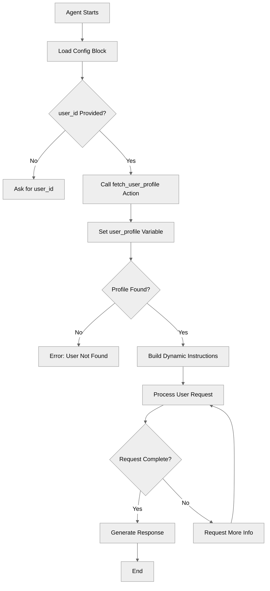

## Validation Checklist

Before finalizing a mermaid diagram, verify:

- [ ] Uses `graph TD` syntax
- [ ] Starts with `%%{init: {'theme':'neutral'}}%%` for theme compatibility
- [ ] Nodes use sequential capital letter IDs (A, B, C, ...)
- [ ] All decision nodes use `{}` syntax
- [ ] All decision nodes end with `?`
- [ ] Decision branches use `|Label|` format
- [ ] Flow is top-to-bottom
- [ ] Labels are clear and concise
- [ ] Diagram is readable and not overcrowded
- [ ] Multi-line labels use `<br/>` appropriately

## Anti-Patterns to Avoid

### Don't

1. Use left-to-right (`graph LR`) orientation
2. Use non-sequential or random node IDs
3. Create overly complex diagrams (>25 nodes)
4. Use ambiguous node labels
5. Create circular dependencies without clear exit
6. Use inconsistent decision branch labels
7. Create nodes with excessive text
8. Leave decision outcomes unlabeled
9. Use custom color styling (breaks in dark mode)
10. Omit the theme initialization directive

### Do

1. Keep it simple and focused
2. Use consistent naming and styling
3. Make decision points clear
4. Show error paths explicitly
5. Highlight key state changes
6. Maintain visual hierarchy
7. Document the happy path clearly
8. Show validation steps
9. Include all relevant outcomes
10. Always use the neutral theme for light/dark mode compatibility

## Summary

These rules ensure that all mermaid diagrams in the Agent Script Recipes repository:

- Are visually consistent
- Follow a predictable structure
- Work in both light and dark modes
- Clearly show flow logic
- Are easy to understand and maintain

Follow these rules when creating or updating any README.md file that includes a mermaid diagram.
