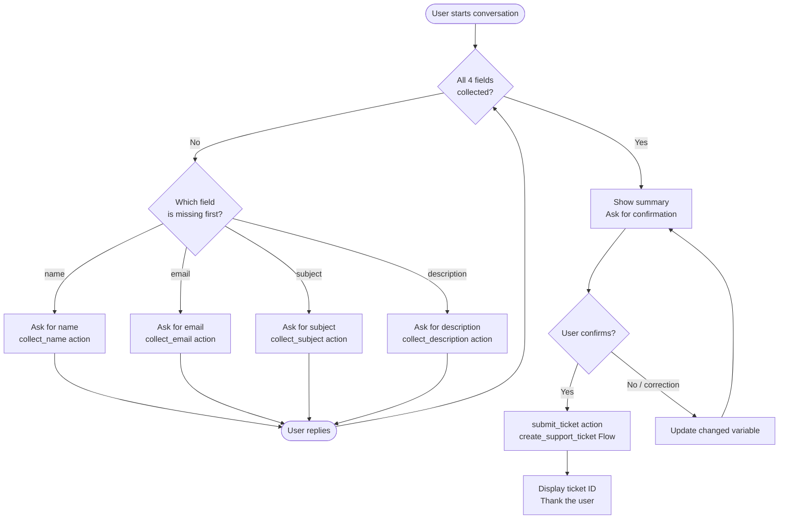

# MultipleInputCollection

Demonstrates two complementary patterns for collecting **several pieces of information** from a user in a single conversation.

---

## Overview

The agent collects four fields needed to create a support ticket:

| Field | Type | Variable |
|-------|------|----------|
| Full name | string | `customer_name` |
| Email address | string | `customer_email` |
| Issue subject | string | `subject` |
| Issue description | string | `description` |

Two collection strategies are shown side-by-side in the same script:

| Pattern | How it works | Best for |
|---------|-------------|----------|
| **A — Conversational** | Asks for one field per turn; advances only when the current field is filled | Long or sensitive forms; users who need guidance |
| **B — Bulk** | Accepts all fields from a single user message | Short forms; power users who provide everything upfront |

---

## Agent Flow



---

## Key Concepts

### 1. One mutable variable per input field

```agentscript
variables:
   customer_name:  mutable string = ""
   customer_email: mutable string = ""
   subject:        mutable string = ""
   description:    mutable string = ""
   ticket_submitted: mutable boolean = False
   ticket_id:      mutable string = ""
```

Each field gets its own variable. Empty string (`""`) or `False` signals "not yet collected".

### 2. Pattern A — Conversational (one field at a time)

The `instructions:->` block inspects every variable in sequence and renders
the first missing one as the next question. The LLM only asks for **one**
field per turn.

```agentscript
if @variables.customer_name == "":
   | - Name : not yet provided  ← ask for this next
else:
   | - Name : {!@variables.customer_name}
...
| Ask for the first field shown above as 'not yet provided'.
  Ask for only ONE field at a time — wait for the user's answer before continuing.
```

Each field has a dedicated `@utils.setVariables` action so the LLM can fill it via slot-filling:

```agentscript
collect_name:  @utils.setVariables
   with customer_name=...

collect_email: @utils.setVariables
   with customer_email=...

collect_subject: @utils.setVariables
   with subject=...

collect_description: @utils.setVariables
   with description=...
```

### 3. Pattern B — Bulk (all fields in one message)

A single action uses multiple `with field=...` bindings:

```agentscript
collect_all_at_once: @utils.setVariables
   available when @variables.customer_name == "" and @variables.customer_email == "" ...
   with customer_name=...
   with customer_email=...
   with subject=...
   with description=...
```

The LLM fills all four slots from a single user message. `available when` restricts this action to the beginning of the conversation before any field has been set.

### 4. Confirmation before submission

After all fields are collected, the agent shows a summary and asks the user to confirm. This guards against slot-filling errors:

```agentscript
| Show the user a summary and confirm before submitting:
  Name       : {!@variables.customer_name}
  Email      : {!@variables.customer_email}
  Subject    : {!@variables.subject}
  Description: {!@variables.description}

  Ask: "Does everything look right? Reply 'yes' to submit or tell me what to change."
```

### 5. Gated submission with `available when`

The submission action only becomes eligible once all fields are populated:

```agentscript
submit_ticket: @actions.create_support_ticket
   available when @variables.customer_name != "" and @variables.customer_email != "" ...
   with name=@variables.customer_name
   with email=@variables.customer_email
   ...
   set @variables.ticket_id = @outputs.ticket_id
   set @variables.ticket_submitted = @outputs.success
```

`available when` prevents the agent from calling the action prematurely.

---

## Example Conversation (Pattern A)

```
Agent: Hi! I'll help you raise a support ticket. Let's start — what's your name?

User : Alex Johnson

Agent: Thanks Alex! What's your email address?

User : alex.johnson@example.com

Agent: Got it. What's the subject of your issue?

User : Cannot log in to the portal

Agent: And can you describe the problem in more detail?

User : I enter my correct credentials but the page just reloads with no error message.
       This started yesterday after the maintenance window.

Agent: Here's a summary of your ticket:
       Name       : Alex Johnson
       Email      : alex.johnson@example.com
       Subject    : Cannot log in to the portal
       Description: I enter my correct credentials but the page just reloads with no
                    error message. This started yesterday after the maintenance window.

       Does everything look right? Reply 'yes' to submit or tell me what to change.

User : Yes

Agent: Your ticket has been submitted! Reference number: TKT-00842.
       Our team will be in touch at alex.johnson@example.com. Thanks for reaching out!
```

## Example Conversation (Pattern B)

```
Agent: Hi! I'll help you raise a support ticket. Let's start — what's your name?

User : Name: Alex Johnson, Email: alex@example.com,
       Subject: Portal login issue,
       Description: Page reloads after login with no error since yesterday's maintenance.

Agent: Here's a summary of your ticket:
       Name       : Alex Johnson
       Email      : alex@example.com
       Subject    : Portal login issue
       Description: Page reloads after login with no error since yesterday's maintenance.

       Does everything look right? Reply 'yes' to submit or tell me what to change.

User : Yes, submit it.

Agent: Ticket submitted! Reference: TKT-00843. We'll contact you at alex@example.com.
```

---

## Adapting This Pattern

### Adding or removing fields

1. Add/remove a `mutable` variable in the `variables:` block.
2. Add/remove a `collect_<field>` action in the `actions:` block.
3. Add/remove the corresponding `if @variables.<field> == "":` guard in `instructions:->`.
4. Update the `available when` condition on `submit_ticket` to include/exclude the new variable.
5. Update the `with <field>=...` bindings on the `submit_ticket` action and the `create_support_ticket` action's inputs.

### Changing the target system

Swap the `target` on `create_support_ticket` to point at your Flow or Apex class:

```agentscript
target: "apex://MyCustomApexClass"   # Apex @InvocableMethod
target: "flow://MyFlow"              # Salesforce Flow
```

### Collecting non-string inputs

```agentscript
# Number
priority: mutable number = 0
   description: "Ticket priority (1 = low, 2 = medium, 3 = high)"

# Boolean
is_urgent: mutable boolean = False
   description: "Whether the issue is blocking production"
```

Use `== 0` or `== False` as the "not yet collected" guard instead of `== ""`.

---

## Files

```
multipleInputCollection/
├── aiAuthoringBundles/
│   └── MultipleInputCollection/
│       ├── MultipleInputCollection.agent           # The agent script
│       └── MultipleInputCollection.bundle-meta.xml # Deployment metadata
└── README.md                                        # This file
```

---

## Related Recipes

- **SingleInputCollection** — The minimal single-field version of this pattern
- **VariableManagement** — Core variable concepts (mutable, types, defaults)
- **MultiStepWorkflows** — Sequential multi-step workflows gated by step number
- **AdvancedInputBindings** — Mixing LLM slot-filling, fixed values, and variable binding
- **ErrorHandling** — Validation and guard clauses for collected inputs
