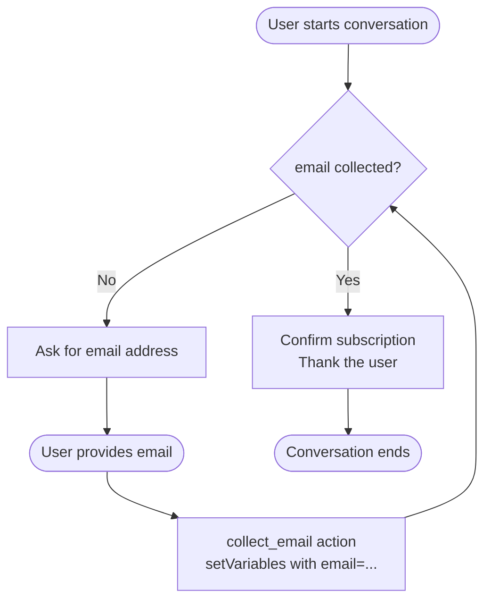

# SingleInputCollection

Demonstrates the simplest pattern for collecting a **single piece of information** from a user chatting with an Agentforce agent — ask once, store it, act on it.

---

## Overview

The agent asks the user for one value (their email address in this recipe), stores it in a `mutable` variable, and then confirms the action. This pattern is the building block for any scenario where the agent needs exactly one input before it can proceed.

**Core techniques shown:**

| Technique | What it does |
|-----------|-------------|
| `mutable string` variable | Holds the collected value across conversation turns |
| `@utils.setVariables` | Platform action that writes a value into a variable |
| LLM slot-filling (`...`) | Lets the model extract the value naturally from the user's message |
| `if @variables.x == "":` | Guards logic so the agent only asks once |

---

## Agent Flow



---

## Key Concepts

### 1. Define a mutable variable for the input

```agentscript
variables:
   email: mutable string = ""
      description: "Email address provided by the user for newsletter subscription"
```

- `mutable` — the agent runtime is allowed to write to this variable.
- Default `""` — an empty string is the "not collected yet" sentinel value.
- `description` — helps the LLM understand what the variable represents.

### 2. Guard your logic with a conditional

```agentscript
if @variables.email == "":
   | No email collected yet. Politely ask the user for their email address.
else:
   | Email collected: {!@variables.email}
     Confirm the subscription with a friendly message...
```

The `if/else` block prevents the agent from asking the same question repeatedly. Once the variable is set, the instructions shift to confirmation.

### 3. Collect the value with LLM slot-filling

```agentscript
actions:
   collect_email: @utils.setVariables
      with email=...
```

The `...` (ellipsis) tells the runtime to let the LLM extract the value from whatever the user said. The model handles natural phrasing — whether the user says `"john@example.com"`, `"my email is john@example.com"`, or `"use john at example dot com"`.

---

## Example Conversation

```
Agent : Hi! I can sign you up for our newsletter.
        What email address should I use?

User  : Sure, it's sarah@example.com

Agent : Perfect! I've signed sarah@example.com up for our newsletter.
        You'll start receiving updates soon. Thanks for subscribing!
```

---

## Adapting This Pattern

Replace `email` with any single value your agent needs:

| Use case | Variable | Description |
|----------|----------|-------------|
| Order lookup | `order_id: mutable string = ""` | Order number to look up |
| Support ticket | `ticket_number: mutable string = ""` | Ticket ID for status check |
| Appointment booking | `preferred_date: mutable string = ""` | Requested appointment date |
| Feedback | `rating: mutable number = 0` | User's satisfaction rating (1–5) |

### Minimum change required

Only two things need to change when adapting the pattern:

1. **Variable name and description** in the `variables:` block.
2. **`with <variable>=...`** in the `collect_*` action under `actions:`.

Everything else (the `if/else` guard, the `@utils.setVariables` action) stays the same.

---

## Files

```
singleInputCollection/
├── aiAuthoringBundles/
│   └── SingleInputCollection/
│       ├── SingleInputCollection.agent           # The agent script
│       └── SingleInputCollection.bundle-meta.xml # Deployment metadata
└── README.md                                      # This file
```

---

## Related Recipes

- **VariableManagement** — State management with multiple variables
- **MultipleInputCollection** — Collecting several inputs in one conversation
- **AdvancedInputBindings** — Mixing LLM slot-filling with fixed and variable-bound values
