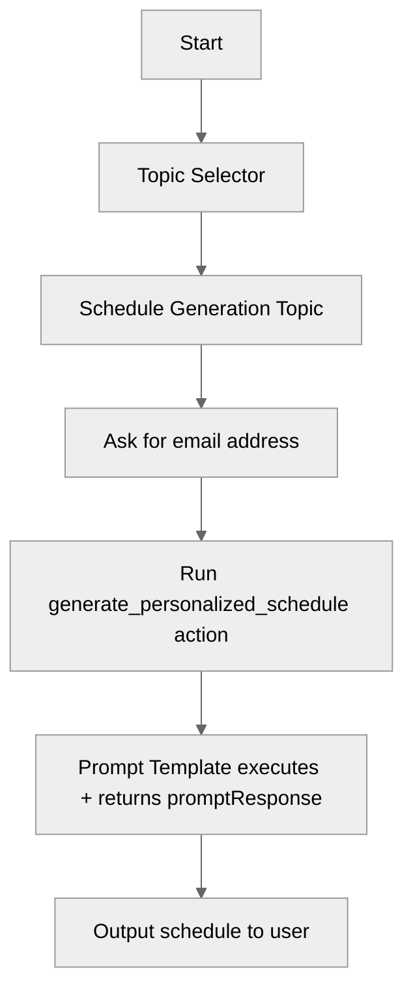

# PromptTemplateActions

## Overview

Learn how to **invoke Salesforce Prompt Templates** from an Agent Script agent as an **action**. This recipe demonstrates how to pass prompt inputs (like an email address) into a prompt template and return the generated response back to the user, while keeping the agent logic simple and repeatable.

## Agent Flow



## Key Concepts

- **Prompt Template action targets**: Use `generatePromptResponse://<PromptTemplateDeveloperName>` to execute a prompt template and return a `promptResponse` string.
- **Prompt Template inputs**: Prompt inputs are passed using the `Input:<apiName>` reference name (for example, `Input:email`).
- **Grounded data via data providers**: Prompt templates can pull grounded data via data providers (for example, an Apex data provider referenced from the template).
- **Topic-scoped execution**: Keep the “ask for missing input” + “run the action” logic inside a focused topic so the agent stays predictable.
- **Displayable outputs**: Mark the `promptResponse` output with `is_displayable: True` and `is_used_by_planner: True` so the planner can surface the generated content directly to the user without intermediate variable storage.

## How It Works

### 1. Create (or reference) a Prompt Template

This recipe includes a prompt template asset named `Generate_Personalized_Schedule` (`genAiPromptTemplates/Generate_Personalized_Schedule.genAiPromptTemplate-meta.xml`). The template:

- Accepts an `email` input (referenced as `Input:email`)
- Uses a data provider (Apex) to retrieve grounded, relevant activities for that guest
- Produces a single text response that the agent can display to the user

### 2. Define an Agent Script action that targets the template

In the agent file (`aiAuthoringBundles/PromptTemplateActions/PromptTemplateActions.agent`), the `generate_personalized_schedule` action is defined with:

- A required input named `"Input:email"` (matching the prompt template input reference name)
- An output named `promptResponse` (the standard response field returned by the prompt execution)
- A `target` pointing at the prompt template by developer name using `generatePromptResponse://Generate_Personalized_Schedule`

The `promptResponse` output is marked `is_displayable: True` and `is_used_by_planner: True`, so the planner can read and display the generated content directly — no intermediate variable storage is needed.

### 3. Ask for required input, then run the action

The `schedule_generation` topic is responsible for collecting the email address. Once the user provides it, the topic runs `generate_personalized_schedule` and outputs the personalized schedule in its response.

The topic instructions include:

- **Never ask about goals, preferences, or interests** — the prompt template retrieves that data from Salesforce via the email.
- **If the user does not provide an email address, ask for it again.**

This pattern keeps the conversation clean:

- The agent only asks for the one required input it truly needs
- The prompt template stays responsible for the “heavy lifting” (content generation and grounded context)

## Complete Recipe Example

```agentscript
# PromptTemplateActions - Using Prompt Template Actions
# This agent demonstrates how to call Prompt Template actions to generate personalized content

system:
    instructions: "You are an assistant that uses Prompt Templates to generate personalized schedules."

    messages:
        welcome: "Hi! I can generate personalized schedules using Prompt Templates."
        error: "Something went wrong."

config:
    agent_name: "PromptTemplateActions"
    agent_label: "PromptTemplateActions"
    agent_type: "AgentforceEmployeeAgent"
    description: "Provides guidance to guests by creating personalized schedules."

start_agent topic_selector:
    description: "Welcome users and begin providing personalized scheduling guidance."

    reasoning:
        instructions:|
            Select the tool that best matches the user's message and conversation history. If it's unclear, make your best guess.
        actions:
            generate_schedule: @utils.transition to @topic.schedule_generation
                description: "Route here for any scheduling request — no prior input needed before routing"

topic schedule_generation:
    description: "Generates a personalized schedule of experiences — all required information is retrieved automatically from Salesforce; do not ask the user about goals, preferences, or interests before generating."

    reasoning:
        instructions: ->
            | When a user asks for help scheduling their day or creating a personalized schedule:
            | 1. Ask for their email address
            | 2. When you have the email address, run {!@actions.generate_personalized_schedule}
            | 3. Output the personalized schedule in a message
            |
            | Never ask about goals, preferences, or interests.
            | If the user does not provide an email address, ask for it again.

        actions:
            generate_personalized_schedule: @actions.generate_personalized_schedule
                with "Input:email" = ...

    actions:
        generate_personalized_schedule:
            description: "Generate a personalized schedule with a prompt template. This action automatically generates a personalized schedule that matches the guest's goals, preferences, or interests by retrieving that information from Salesforce using their email address. This action requires the user's email address."
            inputs:
            # Prompt Template inputs follow pattern, "Input:<Field API Name>"
                "Input:email": string
                    description: "User's email address"
                    is_required: True

            # Prompt Template output is always a promptResponse string
            outputs:
                promptResponse: string
                    description: "The prompt response generated by the action based on the specified prompt and input."
                    is_used_by_planner: True
                    is_displayable: True
            target: "generatePromptResponse://Generate_Personalized_Schedule"
```

## Key Code Snippets

### Action Definition

```agentscript
actions:
  generate_personalized_schedule:
    description: "Generate a personalized schedule with a prompt template. This action automatically generates a personalized schedule that matches the guest's goals, preferences, or interests by retrieving that information from Salesforce using their email address. This action requires the user's email address."
    inputs:
      # Prompt Template inputs follow pattern, "Input:<Field API Name>"
      "Input:email": string
        description: "User's email address"
        is_required: True
    outputs:
      # Prompt Template output is always a promptResponse string
      promptResponse: string
        description: "The prompt response generated by the action based on the specified prompt and input."
        is_used_by_planner: True
        is_displayable: True
    target: "generatePromptResponse://Generate_Personalized_Schedule"
```

### Action Usage (Topic Instructions)

```agentscript
| When a user asks for help scheduling their day or creating a personalized schedule:
| 1. Ask for their email address
| 2. When you have the email address, run {!@actions.generate_personalized_schedule}
| 3. Output the personalized schedule in a message
|
| Never ask about goals, preferences, or interests.
| If the user does not provide an email address, ask for it again.
```

## Try It Out

### Example Interaction

```text
Agent: Hi! I can generate personalized schedules using Prompt Templates.

User: Generate a personalized schedule of experiences for me.

Agent: To create a personalized schedule for you, please provide your email address.

User: alex.reed@example.com

Agent: Here is your personalized schedule of experiences ...

```

## What's Next

- **AdvancedInputBindings**: Explore richer ways to bind variables and inputs into actions.
- **ActionDefinitions**: Learn how to define and document actions the planner can select automatically.
- **ActionCallbacks**: Add post-processing logic (validation, formatting, side effects) after an action runs.
