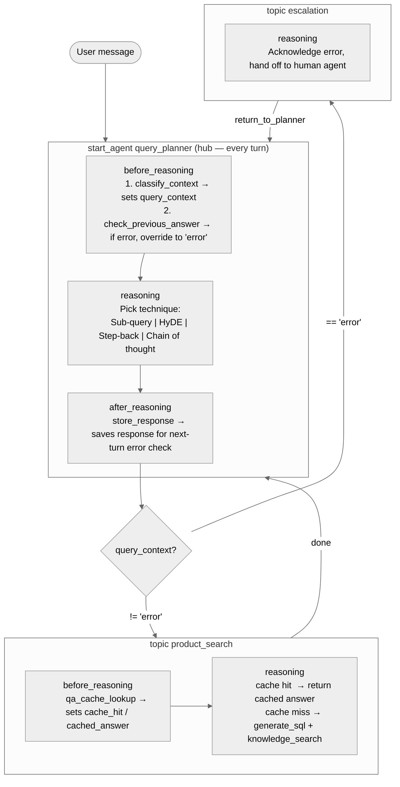

# QueryPlanningRouter

## Overview

This recipe demonstrates how to use `before_reasoning` to classify a user's query into a domain context **before** the LLM reasons, then use that context both to choose a query-planning technique in `reasoning` and to route to the right specialist topic. It combines two reasoning lifecycle hooks (`before_reasoning` and `after_reasoning`) with dynamic conditional routing, showing how pre-classification shapes every downstream decision without requiring an extra conversation turn.

## Agent Flow



## Key Concepts

- **`before_reasoning`**: Runs before the LLM on every turn. Used here for domain classification and previous-answer error detection — work that must inform reasoning rather than be produced by it.
- **`after_reasoning`**: Runs after the LLM response on every turn. Used here to persist the response for quality-checking on the following turn. Can be extended for caching or audit logging.
- **Context override**: If `check_previous_answer` detects an error, `before_reasoning` overrides `query_context` to `"error"`, redirecting the routing actions to escalation automatically.
- **`available when` routing guard**: Routing actions are gated on `@variables.query_context != ""`, so they cannot fire until `before_reasoning` has set the context.
- **Q&A cache in `before_reasoning`**: `product_search` uses its own `before_reasoning` to check a cache before the LLM runs, allowing it to skip SQL and knowledge retrieval entirely on a cache hit.
- **Four query-planning techniques**: The reasoning instructions expose Sub-query decomposition, HyDE, Step-back prompting, and Chain of thought — the LLM picks the right one for each question.

## How It Works

### 1. `before_reasoning` — classify then optionally error-check

On **every turn** that `query_planner` is the active topic, `before_reasoning` runs two steps before the LLM sees the conversation:

```agentscript
before_reasoning:
   run @actions.classify_context
      with user_input=@system_variables.user_input
      set @variables.query_context = @outputs.context

   if @variables.previous_answer != "":
      run @actions.check_previous_answer
         with previous_answer=@variables.previous_answer
         set @variables.previous_answer_has_error = @outputs.has_error
      if @variables.previous_answer_has_error:
         set @variables.query_context = "error"
```

`classify_context` reads the raw user input and returns one of eleven domain tags: `payroll`, `benefit`, `talent`, `outsourcing`, `insurance`, `time_attendance`, `retirement`, `compliance`, `competitor`, `error`, or `general`. The LLM then receives this tag in its instructions and the routing actions become available — all without burning a conversation turn.

If a previous answer exists, `check_previous_answer` inspects it. A detected error overrides the context to `"error"`, which makes only the `escalate` routing action available, ensuring the bad answer is not silently repeated.

### 2. `reasoning` — pick a planning technique

The LLM's job in `query_planner` is to **plan**, not to answer. It chooses from four techniques based on the question type:

| Technique | Best for |
|-----------|----------|
| **Sub-query decomposition** | Multi-part questions needing separate lookups |
| **HyDE** (Hypothetical Document Embedding) | Open-ended questions where phrasing may not match index |
| **Step-back prompting** | Highly specific questions — generalise first to surface deeper knowledge |
| **Chain of thought** | Sequential calculations or multi-step eligibility/compliance logic |

### 3. `after_reasoning` — store for next-turn error detection

```agentscript
after_reasoning:
   run @actions.store_response
      with response=@variables.previous_answer
      set @variables.previous_answer = @outputs.stored_response
```

After every turn `store_response` persists the response so `before_reasoning` can pass it to `check_previous_answer` on the following turn. This is the minimal footprint for a self-correcting quality loop.

### 4. Routing — gated on context

```agentscript
escalate: @utils.transition to @topic.escalation
   available when @variables.query_context == "error"

route_to_product_search: @utils.transition to @topic.product_search
   available when @variables.query_context != "" and @variables.query_context != "error"
```

The empty-string guard (`!= ""`) means routing actions are invisible to the LLM until `before_reasoning` has completed classification. This prevents any premature routing.

### 5. `product_search` — cache-first retrieval

```agentscript
before_reasoning:
   run @actions.qa_cache_lookup
      with query_context=@variables.query_context
      with user_input=@system_variables.user_input
      set @variables.cache_hit = @outputs.cache_hit
      set @variables.cached_answer = @outputs.cached_answer
```

`product_search` uses its own `before_reasoning` to check the Q&A cache before the LLM runs. On a cache hit the reasoning instructions tell the LLM to return `@variables.cached_answer` immediately. On a miss, `generate_sql` and `knowledge_search` are available to the LLM for fresh retrieval.

## Key Code Snippets

### Before-reasoning context classification

```agentscript
before_reasoning:
   run @actions.classify_context
      with user_input=@system_variables.user_input
      set @variables.query_context = @outputs.context

   if @variables.previous_answer != "":
      run @actions.check_previous_answer
         with previous_answer=@variables.previous_answer
         set @variables.previous_answer_has_error = @outputs.has_error
      if @variables.previous_answer_has_error:
         set @variables.query_context = "error"
```

### Routing actions gated on context

```agentscript
escalate: @utils.transition to @topic.escalation
   available when @variables.query_context == "error"

route_to_product_search: @utils.transition to @topic.product_search
   available when @variables.query_context != "" and @variables.query_context != "error"
```

### Cache-first before_reasoning in product_search

```agentscript
before_reasoning:
   run @actions.qa_cache_lookup
      with query_context=@variables.query_context
      with user_input=@system_variables.user_input
      set @variables.cache_hit = @outputs.cache_hit
      set @variables.cached_answer = @outputs.cached_answer
```

### Conditional reasoning instructions based on cache result

```agentscript
instructions:->
   | Domain: {!@variables.query_context}

   if @variables.cache_hit:
      | A cached answer was found:
        {!@variables.cached_answer}
        Return that answer. Do not call generate_sql or knowledge_search.
   else:
      | No cached answer. Retrieve and synthesise a fresh answer:
        1. Call generate_sql for structured product/plan data.
        2. Call knowledge_search for relevant articles.
        3. Synthesise both into a clear, domain-tailored response.
```

## Try It Out

### Example Interaction — payroll question (cache miss)

```text
Agent: Hi! I'm your product advisor. What would you like to know?

User: How does payroll tax calculation work for multi-state employees?

Agent: [before_reasoning → classify_context returns "payroll"]
       [check_previous_answer skipped — no previous answer yet]
       Planning technique chosen: Chain of thought
       Plan: (1) Identify which states the employee worked in, (2) apply
       each state's withholding rules in sequence, (3) reconcile any
       reciprocity agreements.
       [routes to product_search]

       [product_search before_reasoning → qa_cache_lookup: cache miss]
       [generate_sql + knowledge_search called]

       For multi-state employees, payroll tax is calculated state by state...
```

**Behind the scenes:** `before_reasoning` classifies the question as `"payroll"` before the LLM reasons. The LLM picks Chain of thought and states a plan. The routing action sends the turn to `product_search`, which checks the cache (miss), then calls `generate_sql` and `knowledge_search` to build the answer.

### Example Interaction — error detected in previous answer

```text
User: That answer doesn't look right — the withholding rate for California is wrong.

Agent: [before_reasoning → classify_context returns "error"]
       [OR check_previous_answer flags the stored response as incorrect]
       [query_context set to "error" → escalate action fires]

       I'm sorry about that — I'll connect you with one of our specialists
       who can give you the correct figures for California withholding.
```

**Behind the scenes:** Either `classify_context` tags the user's complaint directly as `"error"`, or `check_previous_answer` detects the error in the stored previous answer and overrides the context. Either way only the `escalate` routing action is available.

### Example Interaction — repeated question (cache hit)

```text
User: How does payroll tax calculation work for multi-state employees?

Agent: [before_reasoning → classify_context returns "payroll"]
       [product_search before_reasoning → qa_cache_lookup: CACHE HIT]
       [generate_sql and knowledge_search skipped]

       For multi-state employees, payroll tax is calculated state by state...
       [same answer returned instantly from cache]
```

## What's Next

- **AfterReasoning**: Deeper exploration of the `after_reasoning` lifecycle hook for logging and cleanup.
- **ReasoningInstructions**: How to structure complex procedural instructions for the LLM.
- **ContextualProductAdvisor**: Pre-flight variable collection before routing — a simpler pattern that pairs well with this one.
- **MultiTopicNavigation**: The multi-topic transition pattern that this recipe builds on.
- **ErrorHandling**: Dedicated error-handling patterns for production agents.

## Notes

- `before_reasoning` fires on **every turn** the topic is active. Since `query_planner` is the hub that all specialist topics return to, context classification happens automatically for every user message without any extra wiring.
- `check_previous_answer` is skipped on the very first turn (`previous_answer == ""`), so there is no unnecessary action call on turn 1.
- The `after_reasoning` hook is intentionally minimal here (stores the response). Extend `store_response` to also write to a Q&A cache, audit log, or analytics event stream.
- The eleven domain context tags (`payroll`, `benefit`, `talent`, etc.) are illustrative. Replace them with whatever domain taxonomy fits your use case inside the `ClassifyQueryContext` flow.
